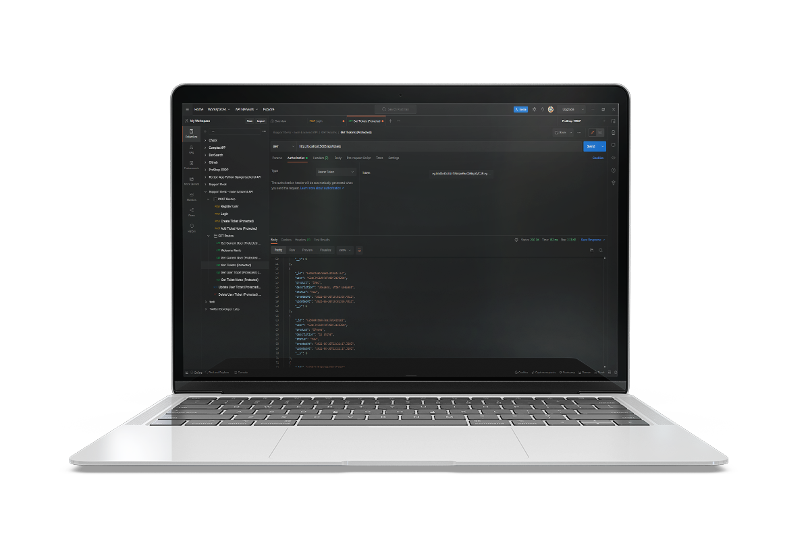

# Support Desk - node backend API with MongoDB Atlas

> API Developed as the first part of a larger backend API for a support desk system.

# Table of Contents

- [Support Desk - node backend API with MongoDB Atlas](#support-desk---node-backend-api-with-mongodb-atlas)
- [Table of Contents](#table-of-contents)
- [Instructions](#instructions)
- [Models](#models)
- [Routes](#routes)

# Instructions

- Run `npm install` to install dependencies in the support-desk directory
- Modify the `dotenv_example` file
  - Rename to .env
  - Assign Port Number to run server on
  - Set up a MongoDB Database on [MongoDB Atlas Cloud Database](https://www.mongodb.com/cloud/atlas)
    - Enter the connection string in the `.env` file
  - Enter your JWT Secret
  - While in the support-desk directory, run `npm run start` to start the server
  - Import the routes into Postman from the `Support Desk - node backend API.postman_collection.json` attached file exported from Postman
  - Use [Postman](https://www.postman.com/) to test the routes
  - Import the `Support Desk - node backend API.postman_collection.json` file into postman to test routes

# Models

- userModel
- ticketModel
- noteModel

# Routes

View routes in `Support Desk - node backend API.postman_collection.json`
